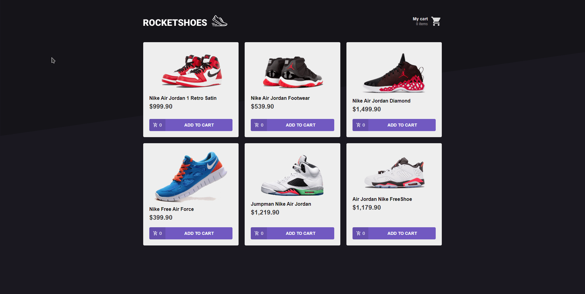

# FluxShoes

<h2 align="center">
  ⚛ ReactJS app to study Redux and Flux architecture
  <!--  -->
</h1>

  <a href="#💻-project">Project</a>&nbsp;&nbsp;&nbsp;|&nbsp;&nbsp;&nbsp;
  <a href="#🔧-tools">Tools</a>&nbsp;&nbsp;&nbsp;|&nbsp;&nbsp;&nbsp;
  <a href="#🏡-running-locally">Running locally</a>

  

 

# 💻 Project

This is a small React-Redux app that consumes a fake API and was created so I can get more familiar with Redux and Flux architecture.

## 🔧 Tools

This project was developed with the following tools:

- [Node.js](https://nodejs.org/en/)
- [React](https://reactjs.org/)
- [Redux](https://redux.js.org/)

# 🏡 Running locally

1. Clone this repository;

2. Access its root directory and execute `yarn` to install all dependencies;

3. Execute `json-server src/assets/data.json -p 3333 -w` to start the fake API.

4. Execute `yarn start` to run the app on a browser.
